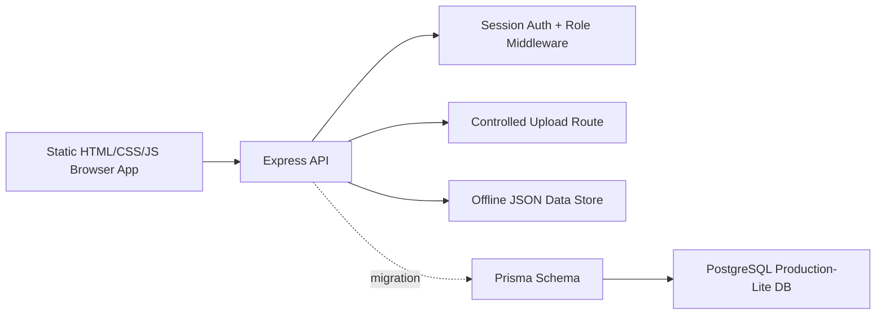
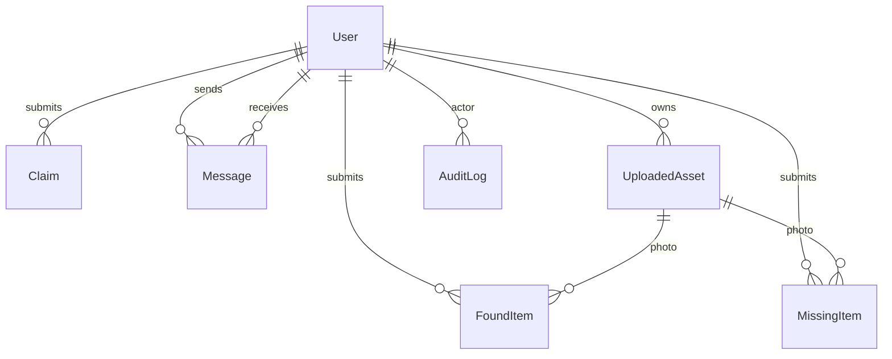

# Architecture

## System Diagram

## Runtime Modes

Default judging mode:

- `server/lib/db.js` reads/writes JSON files in `data/`.
- No database server is required.
- Static assets are local so the app works without Wi-Fi.

Production-lite mode:

- `prisma/schema.prisma` defines users, found items, missing items, claims,
  messages, uploaded assets, and audit logs.
- `scripts/migrate-json-to-postgres.js` migrates JSON demo data into Postgres
  while preserving IDs and relationships.
- `SESSION_STORE=postgres` can move sessions to Postgres when `DATABASE_URL` is
  available.

## Data Model

## Route Map

- `/api/auth`: signup, login, logout, session inspection, account deletion
- `/api/items`: public found search/detail, found report submission, user reports
- `/api/missing-items`: public missing search/detail, missing report submission
- `/api/claims`: submit claims, user claim views, received claims
- `/api/messages`: secure item conversations
- `/api/matches`: local match suggestions
- `/api/admin`: admin-only moderation and message oversight

## Security Model

- Passwords are hashed with bcrypt.
- Login and signup regenerate sessions to reduce fixation risk.
- Admin middleware reloads the user from storage on every protected request.
- Public item DTOs remove contact emails, submitter IDs, and private photo
  profile data.
- Mutating browser requests are checked against the request `Origin`.
- Upload serving is restricted to UUID-style image filenames.
- Helmet security headers and rate limiting are enabled.

## Status Transitions

- Found item: `pending -> approved -> claimed`, or `pending/approved -> rejected`.
- Missing item: `pending -> approved -> found`, or `pending/approved -> rejected`.
- Claim: `pending -> approved/rejected`.
- Admin claim approval validates the linked item before writing status changes.

## Offline Asset Strategy

The homepage scroll story, GLB lens, generated Tailwind CSS, fonts, icons, GSAP,
Three.js, and environment texture are all served from `public/`. The presentation
does not depend on CDN availability.
